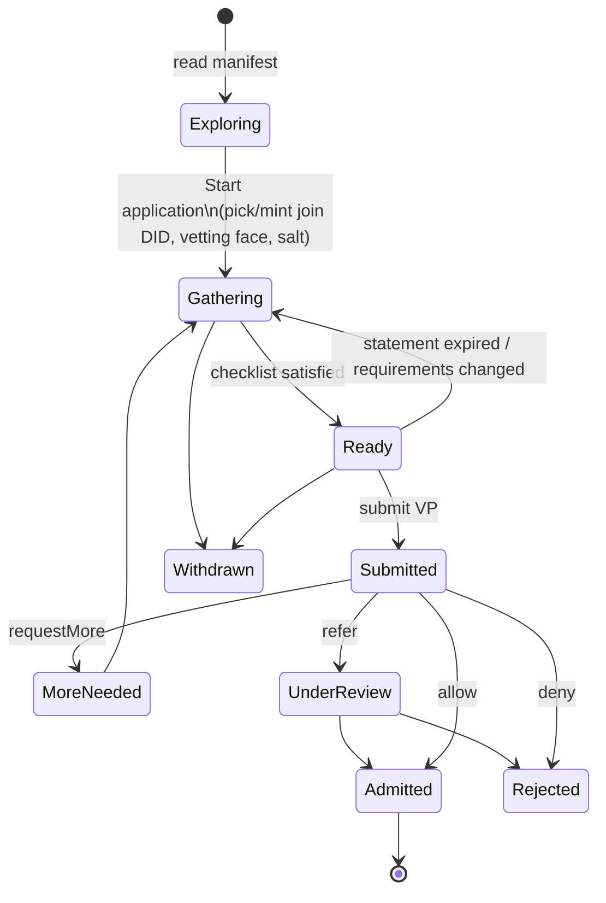

# SPEC — Vetted Admission: Peer Identity Vetting for Joining a VTC

> Status: **DRAFT v2** — O1–O3 and O5 resolved 2026-09-11 (D15–D18); D1–D14
> proposed, pending sign-off (§15). **V0 target: 5 Oct 2026.**
> Scope: end-to-end. This is an OpenVTC design doc, but most of the protocol
> surface lands outside this repo. Each change is tagged with its home repo
> (§14): `trustoverip/dtgwg-trust-tasks-tf`, `trustoverip/dtgwg-cred-spec`,
> `trustoverip/dtgwg-vds-spec`, `OpenVTC/verifiable-trust-infrastructure`
> (VTI), and this repo.
> Replaces: the Linux kernel maintainers' PGP web of trust (§2).
> Related: [multi-community-support.md](./multi-community-support.md) (join,
> D16 pending state), `tasks/d4-scoping.md` (VP construction + requirement
> discovery — this spec supplies D4's missing requirement model).

---

## 1. Objective

An **applicant** wants to join a Verifiable Trust Community (VTC) that does
not admit people on request alone. Existing members who are **vetters** must
first establish that the applicant is a real, identified person who controls
the DID they will join with. The applicant:

1. builds a signed **Vetting Card** (a Verifiable Data Structure) from one of
   their persona faces, bound to the DID they will join with;
2. presents it to several vetters. Each checks it by hand against a passport
   or other identity document, in person or on video, and issues back a
   **Vetting Statement** (a signed credential);
3. once the collected statements satisfy the community's advertised
   requirements, presents them together to the VTC. The VTC evaluates them
   under governance policy and admits (or not).

The spec also answers five operational questions:

| # | Question | Answered in |
|---|----------|-------------|
| Q1 | How does a VTC advertise what it needs? | §6 |
| Q2 | Policy on the VTC side and the OpenVTC side | §10, §11 |
| Q3 | UX and keeping people informed | §12 |
| Q4 | How does an applicant find approved vetters? | §7 |
| Q5 | How do applications reach a vetter without spam? | §8 |

### Success definition

An applicant with no prior standing can, from `openvtc` alone:
- read the community's requirements before disclosing anything;
- find or be handed eligible vetters;
- complete a vetting session with each;
- watch a checklist fill up;
- submit once and be admitted automatically when policy is satisfied.

A vetter can:
- control who may ask them for vetting;
- run a guided session;
- sign a statement they understand;
- never retain the applicant's document data.

The VTC:
- admits on verifiable evidence;
- records what it relied on;
- never publishes who vetted whom.

### Non-goals (this version)

- Zero-knowledge proofs (predicate disclosure, k-of-n proofs over hidden
  vetters) — V2, §14.
- Automated document verification / IDVP integration — V2. Humans check
  documents in V0/V1.
- Sybil-proof uniqueness ("one human, one membership") — V2 (§13.4).
- Affiliation / sanctions attestations — V2 hook only (§10.6).

---

## 2. What we are replacing — the kernel model

These facts come from kernel.org documentation. The pain points that shaped
this design are marked ⚠.

| Kernel today | Detail | OpenVTC vetting |
|---|---|---|
| **Identity** = PGP key | Key held by the developer; 2-year expiry recommended | Persona DID (`did:webvh`) with keys in the VTA, pre-rotation, witnesses |
| **Vouch** = key signature | Signer has "met you personally… OR worked with you for some period", video OK | **Vetting Statement** (VEC) issued by an eligible vetter (§9.4) |
| **Account gate** | Key signed by ≥2 existing kernel.org account holders (2015 AMA said 3) + MAINTAINERS listing or admin exception; helpdesk reviews by hand | `minStatements` from distinct eligible vetters; policy decides automatically, `refer` for edge cases (§10) |
| **Keyring gate** (`pgpkeys.git`) | ≥1 in-repo signature and a trust path to Linus (reported max 5 hops) | Vetter eligibility tiers + **vetting depth** from founding anchors (§10.3) |
| **Key-signing parties**, `ksmap` | ⚠ Public YAML of names + coordinates; in-person bias; geographic exclusion | Opt-in **vetter directory** with coarse region only; tickets/QR at events; video method (§7, §8) |
| **Public graph** | ⚠ Key submissions archived at `lore.kernel.org/keys`; SVG trust-path graphs published | Evidence held privately by the VTC; lineage never published (§10.5, §13) |
| **Decay** | ⚠ GnuPG 2.4 drops SHA-1 sigs → strong set 358→94; re-keying loses sigs | Admission-time evaluation is recorded; membership does not depend on old statements staying valid; cryptosuite agility (§10.4) |
| **Written identity standard** | Personal knowledge / prior contact. Government ID is signing-party custom, **not written policy** | Methods `in-person`, `video`, `prior-acquaintance`. **Each vetter decides what documentation, if any, they accept** (D16) — close to the kernel's own practice |
| **Affiliation** | ⚠ Not in the WoT; the Oct 2024 maintainer removals were handled by hand | Policy hook for affiliation evidence (V2) |
| **Maintainer roles** | `MAINTAINERS` M:/R:/S: entries merged up-tree | VTC roles (custom roles `maintainer`, `reviewer`) + `git-trust/grant` for commit signing (§13.6) |
| **Commit/tag signing** | Signed tags required by Linus; `patatt` TOFU keyrings | `did-git-sign` + `verify-trust` (`OpenVTC/verifiable-git-infrastructure`) |

The Human Trust Experience task force's *Bootstrapping a VTC* kernel summary
(`trustoverip/dtgwg-htx-tf/kernel-onboarding-summary.html`) reaches the same
model, and this spec keeps its terms:
- Layered trust: founder → anchors → vouched members → verified members.
- "Gather-then-present."
- "Rules do the gatekeeping, not people."

---

## 3. Actors and artifacts

### 3.1 Actors

| Actor | Is | Runs |
|---|---|---|
| **Applicant** | A person who wants to join | `openvtc` + their VTA |
| **Vetter** | A current member holding the community's `vetter` role (§10.3) | `openvtc` + their VTA |
| **VTC** | The community service: admission, membership, policy | `vtc-service` |
| **Moderator** | A member with `Moderator`/`Admin` role handling `refer` verdicts | VTC admin UI / `cnm-cli` |
| **Founding anchor** | A member admitted at genesis (depth 0) | — |

### 3.2 Artifacts

| Artifact | Kind (existing term) | Issuer / publisher | Subject / audience | New? |
|---|---|---|---|---|
| **Vetting Requirements** | Manifest criterion extension | VTC | public | New field on `vtc/join-requests/manifest` (§6) |
| **Vetting Ticket** | Short code / QR payload (not a credential) | Vetter | applicant | New (§8) |
| **Vetting Card** | VDS, profile of the **r-card** | Applicant's join DID | one vetter | New VDS profile; signs the existing unsigned r-card render (§9.2) |
| **Vetting Statement** | **VEC** (`EndorsementCredential`) with registered endorsement type `IdentityVetting` | Vetter's member DID | applicant's join DID | New endorsement type; no new DTG credential type (§9.4, D1) |
| **Vetter role** | Role **VEC** (`CommunityRole: vetter`) | VTC | vetter's member DID | Existing mechanism, new role (§10.3) |
| **Admission bundle** | VP in `vtc/join-requests/submit/0.2` | Applicant | VTC | Existing task (§10.1) |
| **Membership** | VMC grant + member acknowledgement, role VEC | VTC / member | — | Existing |

Terms follow DTG Credentials Working Draft 02. Avoid the retired
M-DID/C-DID/R-DID/P-DID terms. "Face" means a persona **profile**, and
"world" means a **facet**.

### 3.3 Which DIDs are used

- **Applicant join DID** — the persona DID (`directed` correlation scope)
  the applicant will join with. Minted or selected **at the start of an
  application**, before gathering, not at submit as D16 does for plain joins.
  Every card, statement and the final VP names this same DID; that is what
  ties the evidence together.
- **Vetter DID** — the vetter's **member DID in this community**. Statements
  must be attributable to a member (accountability, D7). The applicant learns
  it; that is acceptable because both will be members of the same community.

---

## 4. End-to-end flow

```mermaid
sequenceDiagram
  autonumber
  actor A as Applicant (openvtc)
  participant AV as Applicant VTA
  participant C as VTC
  actor V as Vetter (openvtc)
  participant VV as Vetter VTA

  rect rgba(120,120,120,0.08)
  Note over A,C: Phase 1 — Discover (nothing about the applicant is disclosed)
  A->>C: vtc/join-requests/manifest/0.2
  C-->>A: criteria + vetting requirements + requirementsDigest
  A->>C: vtc/vetters/list/0.1 {region, method, language} (V1)
  C-->>A: shuffled sample of eligible, accepting vetters
  end

  rect rgba(120,120,120,0.08)
  Note over A,V: Phase 2 — Reach a vetter
  V->>VV: vetting/tickets/issue/0.1
  VV-->>V: ticket (code XXXX-XXXX + QR)
  Note over A,V: Out of band: in person, email, chat, conference desk
  A->>V: vetting/request/0.1 {ticket, community, joinDid, method}
  V-->>A: #response accepted {requestId, vetter eligibility VP}
  end

  rect rgba(120,120,120,0.08)
  Note over A,V: Phase 3 — Vetting session (in person or on video)
  V->>A: vetting/session/0.1 {challenge, domain, requiredClaims}
  Note over A,V: Both screens show the same match code — read it aloud
  A->>AV: persona/disclosure/preview → present (step-up) → keys/derive-and-sign-document
  A-->>V: #response signed Vetting Card (VDS)
  Note over V: Human check — person ↔ document ↔ card
  V->>VV: sign VEC (step-up)
  V->>A: credential-exchange/issue/0.1 {Vetting Statement}
  A->>AV: vault store (purpose: vetting, community)
  end

  Note over A: Repeat Phases 2–3 until the checklist is satisfied

  rect rgba(120,120,120,0.08)
  Note over A,C: Phase 4 — Present and decide
  A->>C: vtc/join-requests/submit/0.2 {VP: [VIC?] + statements}
  C->>C: verify → VerifiedFacts → join.rego (vetting module) → verdict
  alt allow
    C-->>A: VMC grant + role VEC → reciprocal VMC → git-trust/grant
  else requestMore
    C-->>A: needs (e.g. "1 more in-person statement")
  else refer
    C-->>A: deferred; moderators notified
  else deny
    C-->>A: reason code
  end
  end
```

Phase 0 (genesis / migration) is in §13.

### 4.1 Ceremony definitions

Two Trust Ceremonies (`trustoverip/dtgwg-trust-tasks-tf/ceremonies/`)
describe the flow.

- **`vetting/identity-vetting/0.1`** (new) — one enactment per vetter:
  - roles `applicant`, `vetter`
  - steps `request` → `session` → (`attest` = `credential-exchange/issue/0.1` | `decline` = `vetting/decline/0.1`)
  - `completion: allOf[request, session, anyOf[attest, decline]]`
  - `maxDuration: P30D`, `evidence.level: countersigned`
  - `enactmentPrivacy: blinded`
- **`vtc/member-onboarding/0.1`** (existing, unchanged) — `apply` carries
  the statements as evidence.

The VTC relies on the **statements**, never on ceremony receipts. The Trust
Tasks framework says a consumer "MUST NOT grant any authority on the basis of
ceremony membership alone", and VTI-CMP-020 says protocol success is not the
trust outcome.

---

## 5. Protocol surface (summary)

All peer tasks travel as Trust Task documents over DIDComm authcrypt
(`openvtc-core/src/didcomm.rs::pack_and_send`) or TSP, as join does today.
Type URIs are `https://trusttasks.org/spec/<slug>/<version>`. "Proof" means
DataIntegrity `eddsa-jcs-2022`.

| Slug | From → To | Purpose | Proof | Phase |
|---|---|---|---|---|
| `vtc/join-requests/manifest/0.2` | anyone → VTC | Adds `vetting` requirement object to criteria (§6) | RECOMMENDED | V0 |
| `vtc/vetters/list/0.1` | anyone → VTC | Filtered, sampled, opt-in vetter directory (§7) | RECOMMENDED | V1 |
| `vetting/tickets/issue/0.1`, `…/list/0.1`, `…/revoke/0.1` | vetter → own VTA | Mint/list/revoke tickets (§8) | REQUIRED | V1 (V0: client-local) |
| `vetting/request/0.1` | applicant → vetter | Ask to be vetted; carries ticket (§8.3) | REQUIRED | V0 |
| `vetting/session/0.1` | vetter → applicant | Open session; response is the signed Vetting Card (§9.1) | request REQUIRED, response REQUIRED | V0 |
| `credential-exchange/issue/0.1` | vetter → applicant | Deliver the Vetting Statement (existing task) | REQUIRED | V0 |
| `vetting/decline/0.1` | vetter → applicant | Decline, with an optional reason code (§9.5) | REQUIRED | V0 |
| `trust-task-control` (cancel) | either → either | Withdraw a request / cancel a session (existing) | REQUIRED | V0 |
| `vtc/vetting/revoke-statement/0.1` | vetter → VTC | Withdraw a statement (§9.6) | REQUIRED | V0 |
| `vtc/vetting/concern/0.1` | vetter → VTC | Report suspected fraud to moderators (§10.5) | REQUIRED | V1 |
| `vtc/join-requests/submit/0.2` | applicant → VTC | Existing; VP now carries statements | REQUIRED | V0 |

Every new spec carries the framework's required front matter:
`parties` + `identifierScope`, `sideEffects`, `exposure`, `retention`,
`errorCodes`, `## Authorization`, `## Security & Privacy`. Per the framework,
task specs **do not** declare consent or step-up; that is VTA policy (§11.3).

---

## 6. Q1 — How a VTC advertises what it needs

### 6.1 Where

1. **Machine-readable, authoritative:** `vtc/join-requests/manifest/0.2`.
   Each criterion keeps its DCQL `presentationDefinition` and gains an
   optional `vetting` object. DCQL can express "credentials of type X" but
   not "distinct eligible issuers", independence, or methods, so those live
   in `vetting`. The VTC stores it alongside the existing `AcceptsCriterion`
   (`vtc-service/src/schemas/accepts.rs`).
2. **Human-readable summary:** `CommunityProfile.extensions["org.openvtc.vetting"]`
   holds a plain-language description and a link to the governance framework
   (`PersonhoodGovernance.governanceFrameworkUrl`). It is served
   unauthenticated at `GET /v1/community/public-profile` so a web page or
   `openvtc` can show it before any Trust Task is sent.

`manifest` is the one join-family task that leaves no trace of an applicant.
That keeps **informed non-application** possible: a person can learn that a
community demands a passport check and walk away having disclosed nothing.

### 6.2 The `vetting` requirement object

```json
{
  "id": "kernel-developer",
  "description": "Two existing kernel vetters must confirm who you are. At least one must meet you in person.",
  "presentationDefinition": { "credentials": [ { "id": "vetting", "format": "ldp_vc", "multiple": true,
      "meta": { "type_values": [["EndorsementCredential"]] } } ] },
  "vetting": {
    "version": "0.1",
    "statementType": "https://firstperson.network/endorsements/identity-vetting/0.1",
    "minStatements": 2,
    "minByMethod": { "in-person": 1 },
    "acceptedMethods": ["in-person", "video", "prior-acquaintance"],
    "requiredClaims": ["name.legal"],
    "optionalClaims": ["account.handle", "url.homepage"],
    "maxStatementAge": "P120D",
    "eligibleVetters": { "role": "vetter" },
    "independence": {
      "maxByDeclaredRelationship": { "family": 0, "same-employer": 1 },
      "requireConsistentIdentityCommitment": true
    },
    "invitation": "optional",
    "tickets": "vetter-policy",
    "vetterDirectory": true,
    "decisionSla": "P14D",
    "requirementsGrace": "P30D",
    "governanceFrameworkUrl": "https://example.org/kernel-vtc/governance#vetting"
  },
  "requirementsDigest": "z…"
}
```

The DCQL shape above is illustrative. It must follow what
`vta_sdk::vp::select_credentials` accepts (VTI#437).

**Every number here is community policy** (D15). The protocol has no default
statement count, method floor or age limit; the values above are an example
of what a kernel community might publish. Documentation is not listed because
each vetter decides what they accept (D16).

| Field | Meaning |
|---|---|
| `statementType` | Endorsement `typeUri` registered via `vtc/endorsement-types/register/0.1`, with its `claimSchema` (§9.4) |
| `minStatements` | Distinct eligible vetters, counted by **member record**, not DID (§10.2). Set by each community; no protocol default (D15) |
| `minByMethod` | Per-method floors (e.g. at least one `in-person`) |
| `acceptedMethods` | Methods that count at all. `prior-acquaintance` encodes the kernel's written "worked with you" standard |
| `acceptedDocumentClasses` | **Optional, absent by default.** When absent, each vetter decides what documentation they accept (D16). A community that later needs a floor can set it; statements outside it then don't count |
| `requiredClaims` | Claim types (from the VTA claim-type registry) the Vetting Card must carry and the vetter must mark verified |
| `maxStatementAge` | A statement older than this at submit does not count |
| `eligibleVetters` | How eligibility is proven; V0 = holds the community's `vetter` role VEC (§10.3) |
| `independence` | Caps on declared vetter↔applicant relationships; require the identity commitment to match across statements (§9.3) |
| `invitation` | `required` / `optional` / `none` — whether a VIC must also be in the VP |
| `decisionSla` | What the applicant's client uses in place of the hardcoded 7-day pending expiry (D16) |
| `requirementsGrace` | How long an application started under an older `requirementsDigest` is evaluated under that version |

### 6.3 Versioning

- `requirementsDigest` is the `digestMultibase` (JCS → SHA-256 multihash →
  base58btc) over the criterion without the digest field itself.
- The applicant's client stores the digest when the application starts and
  sends it in every `vetting/request` and in `submit` `extensions`.
- The VTC **must record which requirements version governed a decision**
  (VTI-VTC-031).
- If requirements change, the VTC evaluates under the applicant's recorded
  version while it is within `requirementsGrace`, and says so in the verdict.
- The client shows "requirements changed" with a diff (§12).

---

## 7. Q4 — How an applicant finds vetters

There are three routes, from most to least social.

1. **Someone they already know** (the kernel's normal case — your subsystem
   maintainer). The applicant enters the vetter's agent name
   (`kernel.org/@carol`), DID, or scans their QR. The name is resolved and
   verified round-trip via `agent_name::resolve_identifier`, and the DID is
   what gets persisted (CLAUDE.md rules).
2. **Events — the key-signing party replacement.** The vetter opens a
   **vetting desk**: a multi-use ticket shown as a QR with a short expiry
   (§8.2). Applicants in the room scan it and sessions run one after another.
   Events are announced in the directory (below).
3. **Vetter directory** (V1) — `vtc/vetters/list/0.1`:
   - **Opt-in.** A vetter chooses to be listed; unlisted vetters are
     reachable only through routes 1–2.
   - **Pre-membership.** Callable by non-members, unlike
     `directory.rego`, which denies non-members.
   - **Filters:** `method`, `language`, `region` (country or continent only —
     never a city or coordinates, fixing the `ksmap` privacy failure),
     `event`, `area` (free tags such as `mm`, `net`, `rust`).
   - **Sampled, not enumerable.** Returns up to `k` (default 5) matching
     vetters, shuffled and weighted toward vetters with spare capacity. That
     spreads load and resists scraping of the vetter set. Rate-limited per IP
     and per requesting DID.
   - **Entry:** vetter DID, verified agent name if any, languages, methods,
     accepted documentation,
     region, upcoming events (`{name, dates}`), `accepting | limited | paused`,
     and whether the vetter accepts ticket-less requests (§8.4).
   - Governed by a new `vetters.rego` projection policy, capped by the
     community's PII boundary like `directory.rego`.

### 7.1 Confirming a vetter is eligible before spending effort

The vetter's `vetting/request` `#response` carries an **eligibility VP**: the
vetter's community-issued VMC plus the `CommunityRole: vetter` VEC, bound to
the `requestId` as the challenge. The applicant's client verifies:
- the issuer is the community DID;
- the subject is the vetter DID;
- neither credential has been revoked.

This works for unlisted vetters and needs no VTC round-trip. The VTC still
re-checks eligibility at decision time (§10.2), so this is advisory.

---

## 8. Q5 — Getting applications to a vetter without spam

### 8.1 Principle

A vetter is only notified about requests that pass their **gate**. By
default a request passes only if it carries a valid **Vetting Ticket** the
vetter issued. Requests that fail the gate are dropped **before** a
notification or push, and are counted, never listed individually (§12.3).

### 8.2 Vetting Ticket

| Property | Default | Notes |
|---|---|---|
| `code` | 8 Crockford base32 chars, `XXXX-XXXX` (40 bits), CSPRNG | Spoken or typed. **Not** derived like the personhood match code; it is a secret |
| `qr` | `{ vetter, community, ticketId, secret(32 bytes b64url) }` | Scanned; full-entropy, so not subject to guess limits |
| `community` | required | A ticket is for vetting *for one community* |
| `uses` | 1 | Desk mode: e.g. 50 |
| `expiresAt` | 14 days | Desk mode: e.g. 8 hours |
| `boundTo` | set on first redemption | Later messages on the thread must come from the same applicant DID |
| `note` | optional, vetter-private | e.g. "Alice, met at LPC" |
| `methods` | optional | Restrict to `in-person` for desk tickets |

Redemption is checked in constant time and is single-use per `uses`.
Throttling:
- ≥5 failed redemptions per sender DID per hour → that sender is dropped
  silently for the hour.
- A global failure spike → the gate stops accepting short codes (QR secrets
  still work) and the vetter sees "code guessing detected — codes paused".

**Where the gate lives.**
- **V0:** tickets are stored in `ProtectedConfig` (per community, like
  `tasks`). The gate runs in `openvtc-core/src/message_dispatch.rs` before a
  `TaskType` is created.
- **V1:** tickets move to the vetter's VTA (`vetting/tickets/*`). The gate
  runs as `vta-policy` Rego on the inbound task URI, so rejected requests
  never reach a device or the push gateway, and tickets work across the
  vetter's devices.

The mediator cannot see payloads (authcrypt), so it contributes only
per-sender transport rate limiting.

### 8.3 `vetting/request/0.1` payload

```json
{
  "community": "did:webvh:…:kernel-vtc",
  "requirementsDigest": "z…",
  "joinDid": "did:webvh:…:alice-kernel",
  "ticket": { "code": "K7QF-2M9X" },
  "introduction": null,
  "preferredMethod": "video",
  "languages": ["en", "de"],
  "message": "Hi Carol — we worked on the mm reclaim series in 2025.",
  "availability": "Weekdays 14:00–18:00 UTC"
}
```

**Validation:** `issuer` MUST equal `joinDid`. `ticket` and `introduction`
are mutually exclusive, and at least one is required unless the vetter's
policy is `open`.

**`#response`:**
- `accepted`: `{ requestId, eligibilityVp, acceptsDocumentation, sessionHint }`.
  `acceptsDocumentation` is the vetter's own list (§11.2), so the applicant
  brings the right thing.
- `refused`: `{ code }`, where `code` is one of `vetting/request:invalidTicket`
  (only sent for QR secrets — a failed short code gets silence),
  `:capacity`, `:notEligible` (the vetter is not currently a vetter for that
  community), `:declined`, `:methodUnavailable`

Scheduling the meeting is out of band in V0 (email/chat/calendar).
`availability` and `sessionHint` are free text.

### 8.4 Vetter gate policy (local to the vetter)

| `acceptRequests` | Passes the gate |
|---|---|
| `ticket` (default) | Valid ticket only |
| `ticket-or-introduction` | Valid ticket, **or** a VIC for this community naming the applicant's `joinDid`, issued by the community or a member — the existing VIC mechanism, used as a member introduction |
| `open` | Anything, subject to `maxOpenRequests` and per-sender limits. Intended for vetters who staff a public queue |

**Capacity.** When `maxOpenRequests` (default 10) is reached, the vetter's
directory entry flips to `paused`, and new requests get
`:capacity` — even with a valid ticket, unless the ticket was issued in
desk mode.

---

## 9. The vetting session

### 9.1 Opening — `vetting/session/0.1`

The vetter starts the session when both people are together, in the room or
on a call. **Request** (vetter → applicant):

```json
{
  "requestId": "…",
  "challenge": "b64url(32 bytes)",
  "domain": "did:webvh:…:kernel-vtc",
  "method": "video",
  "requiredClaims": ["name.legal"],
  "optionalClaims": ["account.handle"],
  "expiresAt": "+15m"
}
```

**Match code (liveness + DID binding).** Both clients derive the same
`XXXX-XXXX` code from the session document's `id`. They reuse
`openvtc-core/src/personhood.rs::match_code`'s construction with a distinct
domain tag, e.g. `org.openvtc.vetting.match-code.v1`. The two people read it
to each other. This establishes that the person in front of the vetter is
driving the client that controls `joinDid` *in this session*. The
applicant's client refuses to present a card until the applicant confirms
the code, and the vetter's statement records `livenessConfirmed`.

**`#response`** (applicant → vetter): the signed **Vetting Card** (§9.2).
The session request's `id` is the value the statement later carries as
`taskContext`, mirroring `witness/session/0.1`.

### 9.2 Vetting Card — a VDS

The DTG VDS spec is still an empty template. The only normative text is:

> "A data structure digitally signed by the publisher so that subscribers are
> able to cryptographically verify the authenticity of both the original and
> any updates… An r-card is another type of VDS."

The Vetting Card is therefore proposed as **a profile of the r-card**. It is
the first concrete content for `trustoverip/dtgwg-vds-spec`.

It is produced by the existing persona disclosure pipeline, with one change —
it gets signed:

1. The applicant picks a **face** (profile) — typically a "Vetting" face
   containing `name.legal` and optional handles — worn by the join persona in
   this community's context (`persona/binding/set`).
2. `persona/disclosure/preview/1.0` produces a summary. The client shows
   exactly what the vetter will see.
3. `persona/disclosure/present/1.0` with renderer `rcard`. This triggers
   step-up for `release: stepUp` claims, consumes the preview, and writes a
   `DisclosureRecord`.
4. **New:** the rendered r-card (today
   `vta-persona/src/present.rs` emits `"unsigned": true`) is signed with the
   join DID's assertion key via `keys/derive-and-sign-document` (exists in
   `vta-sdk/src/protocols/key_management/derive_and_sign_document.rs`). The
   `unsigned` marker is dropped only on this signed path.

```json
{
  "type": ["VerifiableDataStructure", "RelationshipCard", "VettingCard"],
  "id": "urn:uuid:…",
  "publisher": "did:webvh:…:alice-kernel",
  "cardVersion": 1,
  "audience": "did:webvh:…:carol-kernel",
  "community": "did:webvh:…:kernel-vtc",
  "challenge": "…from vetting/session…",
  "domain": "did:webvh:…:kernel-vtc",
  "issuedAt": "2026-09-20T10:12:00Z",
  "expiresAt": "2026-09-20T10:27:00Z",
  "claims": [
    { "type": "name.legal", "value": "Alice Example", "provenance": "selfAsserted" },
    { "type": "account.handle", "value": "alice@example.org", "provenance": "selfAsserted" }
  ],
  "identityCommitment": "z…",
  "commitmentSalt": "b64url(32 bytes)",
  "proof": { "type": "DataIntegrityProof", "cryptosuite": "eddsa-jcs-2022",
             "verificationMethod": "did:webvh:…:alice-kernel#key-1",
             "proofPurpose": "assertionMethod", "proofValue": "z…" }
}
```

The `claims` element shape follows the existing `rcard` renderer and is
illustrative here.

Rules:
- **Bound:** `audience` = vetter DID, `challenge`/`domain` from the session,
  15-minute validity. A card cannot be replayed to another vetter or session.
- **`identityCommitment`** = `digestMultibase(JCS({salt, claims: [required identity claims]}))`.
  The applicant's client generates one salt **per application** and reuses
  it on every card, so every vetter sees the same commitment. The salt goes
  only to vetters (inside the card), never to the VTC. This lets the VTC
  check that all vetters verified the *same* claimed identity (§10.2) without
  learning it. It also answers the unsalted low-entropy digest problem
  (dtgwg-cred-spec #38) for this use.
- **Provenance** is `selfAsserted` in V0/V1; the human check is what adds
  assurance. In V2 a `credentialBacked` claim from an IDVC can ride along,
  which lets a community lower `minStatements` when one is present.
- **No document numbers or images.** The card never carries a document
  number, scan, or portrait by default. The vetter looks at the real
  document; nothing about it is transmitted. A `person.portrait` claim type
  is deliberately not in V0 (D17).

### 9.3 The human check (vetter)

The vetter's client verifies the card before showing the checklist:
- signature by `publisher`;
- `publisher` = `joinDid`;
- `audience` = self;
- the challenge matches;
- not expired;
- `identityCommitment` recomputes from the salt and claims.

Then it shows a guided checklist. All items are required unless marked:

1. ☐ We read the same match code to each other.
2. ☐ Method: in person / video / prior acquaintance.
3. ☐ Documentation relied on — whatever this vetter accepts (D16): passport /
   national ID / driver licence / other (named) / none, I know this person.
4. ☐ (if a document) The document appeared genuine and unaltered to me.
5. ☐ (if a document) The photo on the document matches the person I am
   talking to.
6. ☐ The name on the document — or the name I know this person by —
   matches `name.legal` on the card.
7. ☐ (optional, per claim) I recognise `account.handle` as this person's.
8. Declare your relationship to the applicant: none / community colleague /
   same employer / family / other personal.
9. The **attestation text** (from the community's governance framework) is
   shown in full before signing, e.g. *"I attest that on [date] I verified,
   by [method], that the person controlling [joinDid] presented [document
   class] matching the name above. I did not retain copies of the document.
   I understand this statement is attributable to me within [community]."*

The vetter's client **must not** offer photo capture and must not persist
document details. The card itself is retained only per the vetter's
`cardRetention` (default: delete 7 days after the statement is issued; keep
only `cardDigestMultibase`).

### 9.4 Vetting Statement — a VEC

**Why a VEC** (D1). DTG WD02 defines a VEC as the credential that "enables
one party to a DTG edge trust relationship to issue verifiable assertions
about the counterparty", with an `endorsement` object whose "structure and
fields [are] determined by community policy". A VTC already has an
endorsement-type registry with `claimSchema`. The two other candidates don't
fit:
- a **VWC**'s digest must point at an edge credential;
- an **IDVC** is defined as issued by a commercial IDVP.

A new DTG type would need coordination with the cred task force (governance
consideration 9) for no gain.

The VEC definition presumes an edge. The accepted `vetting/request` + session
exchange is that relationship. A VRC pair is **not required** in V0 (D8); a
community may require one (`vetting.requireVrc`) if it wants the edges for
later graph analysis (§10.5).

```json
{
  "@context": ["https://www.w3.org/ns/credentials/v2",
               "https://firstperson.network/credentials/dtg/v1"],
  "type": ["VerifiableCredential", "DTGCredential", "EndorsementCredential"],
  "issuer": "did:webvh:…:carol-kernel",
  "validFrom": "2026-09-20T10:14:00Z",
  "validUntil": "2027-01-18T10:14:00Z",
  "taskContext": "urn:uuid:<vetting/session document id>",
  "credentialSubject": {
    "id": "did:webvh:…:alice-kernel",
    "endorsement": {
      "type": "https://firstperson.network/endorsements/identity-vetting/0.1",
      "community": "did:webvh:…:kernel-vtc",
      "method": "video",
      "documentClasses": ["passport"],
      "claimsVerified": ["name.legal"],
      "livenessConfirmed": true,
      "identityCommitment": "z…",
      "cardDigestMultibase": "z…",
      "declaredRelationship": "community-colleague",
      "attestationTextDigest": "z…"
    }
  },
  "proof": { "type": "DataIntegrityProof", "cryptosuite": "eddsa-jcs-2022", "…": "…" }
}
```

The `taskContext` shape must match WD02 §taskContext; the value above is
illustrative.

| Field | Rule |
|---|---|
| `issuer` | Vetter's member DID in `community` |
| `credentialSubject.id` | The applicant's `joinDid` |
| `validUntil` | = `validFrom` + the community's `maxStatementAge`. Statements are *pre-admission evidence*, not a lifelong credential |
| `endorsement.community` | Scopes the statement. Another community MUST NOT count it without explicit recognition policy (VTI-REG "Recognition MUST NOT be transitive") |
| `endorsement.documentClasses` | What the vetter relied on, from their own accepted list (D16); `[]` with `prior-acquaintance` |
| `cardDigestMultibase` | Digest of the card **in the exact transmitted form** (VTI-MEM-021; `dtg_credentials::digest_multibase_json`). Used for dispute and audit. The VTC never needs the card |
| `attestationTextDigest` | Digest of the governance text the vetter saw, so the text version is provable |
| `credentialStatus` | Absent in V0; revocation goes to the VTC (§9.6, D18). Added in V1 with VTA-hosted status lists |

Issuance goes through the vetter's VTA and requires **step-up** (§11.3).
Delivery uses the existing `credential-exchange/issue/0.1`. The applicant's
client verifies the statement (proof, subject, community, commitment equals
its own, card digest equals what it sent) and stores it in the VTA vault
with `purpose: "vetting"`, tagged with the community.

**Registration.** The VTC registers the type once via
`vtc/endorsement-types/register/0.1` with a `claimSchema` covering
`endorsement`.

**Implementation note.** The VTC's issuance route
`vtc/endorsements/issue` (Admin/Issuer only, community-issued) is **not**
used. Statements are member-issued by the vetter's own VTA, using
`DTGCredential::new_vec` from `dtg-credentials`.

### 9.5 Decline

`vetting/decline/0.1`: `{ requestId, code?, message? }`, where `code` is one
of `could-not-verify`, `document-mismatch`, `liveness-failed`, `not-comfortable`,
`other`.
- The code is optional; a vetter never has to justify declining.
- Declines are **not** sent to the VTC.
- A vetter who suspects fraud uses `vtc/vetting/concern/0.1` separately (V1,
  §10.5).

The applicant sees the decline and may approach other vetters.

### 9.6 Revocation

A vetter can withdraw a statement at any time — a mistake, new information,
or a compromised key (D18).

**What exists today.** The VTA's `spec/vta/credentials/revoke/0.1` sets
`revoked_at` on the VTA's own credential record, a local tombstone
(`vta-service/src/operations/credentials.rs`). Nothing is published that a
verifier can check. Bitstring status lists are *published* only by the VTC
(`vtc-service/src/status_list/`); the VTA only *resolves* other issuers'
lists (`StatusListResolver`).

**V0 — revoke to the community.** The one party that relies on a statement is
the VTC, so the vetter tells it directly. A per-vetter status list would be a
poor fit anyway: a list holding a handful of one vetter's statements gives no
herd privacy (VTI-CRD-011/012).

- `vtc/vetting/revoke-statement/0.1` (vetter → VTC; proof REQUIRED; step-up at
  the vetter's VTA): `{ statementId, statementDigestMultibase, reason? }`,
  where `reason` is one of `mistake`, `new-information`, `key-compromise`,
  `other`. The vetter's client also runs `credentials/revoke` locally so its
  Issued list shows the statement as revoked.
- The VTC authenticates the sender as the statement's issuer (member DID),
  records the notice keyed by statement id, and audits it. Notices received
  before the applicant submits are kept for `maxStatementAge`.
- **Before admission:** the statement does not count (`revoked: true` in
  facts). A pending application is re-evaluated; the applicant sees
  `requestMore`.
- **After admission:** `on_statement_revoked` runs (§10.5) — review, not
  removal, by default.
- The applicant is told a statement they hold was withdrawn. The reason is
  shared only if the vetter chooses.

**V1 — VTA-hosted status lists.** When statements must be checkable by
parties other than their community (cross-community recognition), add a
status list service to the VTA by lifting the VTC's allocator and storage
into a shared crate. Lists are shared across all issuers on a VTA for herd
size. Statements then carry `credentialStatus`, and the VTC checks both.

---

## 10. Admission (VTC side)

### 10.1 Submit

The applicant's client builds the VP with the existing
`openvtc-core/src/presentation.rs`:
- `held_credentials` → `evaluate_query(dcql, …)` → consent screen →
  `present(…)`;
- today these functions have no call sites; this is D4 of `tasks/d4-scoping.md`.

It sends the VP via `submit_join_request` (`openvtc-core/src/join.rs`):
- holder = `joinDid`;
- audience = the VTC, with the VTC's single-use challenge (VTI-CRD-021/022);
- contents: the selected statements, plus a VIC if `invitation: required`;
- `extensions`: `requirementsDigest`.

### 10.2 Verification → facts

The VTC's ceremony pipeline (`vtc-service/src/join/orchestrate.rs`,
`ceremony/*`) is extended. For each `EndorsementCredential` whose
`endorsement.type` is a registered vetting type, the VTC checks:

1. The VP proof is valid, holder = `joinDid`, and challenge + audience are
   correct (already done).
2. The VEC proof is valid; the issuer DID resolves (webvh log verified).
3. `endorsement` validates against the registered `claimSchema`.
4. `credentialSubject.id` = VP holder.
5. `endorsement.community` = this VTC.
6. `validFrom ≤ now ≤ validUntil` and age ≤ `maxStatementAge`.
7. Not revoked: no revocation notice for this statement id (§9.6). From V1,
   also the `credentialStatus` entry, within the freshness window.
8. **Issuer is an eligible vetter.** This check is new. The issuer DID
   resolves to a member record that:
   - is `active`;
   - held a valid `vetter` role VEC **at `validFrom`**;
   - still holds it **now**, or policy allows post-issuance lapse
     (`eligibleAtIssuanceOnly`).

Today `issuer_trusted` (`vtc-service/src/routes/join_requests/present.rs`)
returns true only for the community DID or a registry-recognised issuer.
Vetting adds a **third path that produces facts, not a boolean**, so policy
decides.

The pipeline then assembles facts:
- **distinct vetters** — group by `member_id`, so a vetter with two DIDs
  counts once (VTI-CMP-070: independence "MUST be established by evidence");
- **commitment consistency** — all `identityCommitment` values are equal;
- **counts** by method and by declared relationship.

Facts (`input.facts.vetting`), shape sketch:

```json
{
  "requirements_version": "z…",
  "statements": [
    { "id": "urn:uuid:…", "verified": true, "issuer_member_id": "m_91", "issuer_depth": 2,
      "eligible_at_issuance": true, "eligible_now": true, "method": "in-person",
      "document_classes": ["passport"], "claims_verified": ["name.legal"],
      "declared_relationship": "none", "age_days": 12, "within_max_age": true, "revoked": false,
      "failures": [] },
    { "id": "urn:uuid:…", "verified": true, "issuer_member_id": "m_07", "issuer_depth": 1,
      "eligible_at_issuance": true, "eligible_now": true, "method": "video",
      "document_classes": ["national-id"], "claims_verified": ["name.legal"],
      "declared_relationship": "community-colleague", "age_days": 40, "within_max_age": true, "revoked": false,
      "failures": [] }
  ],
  "distinct_counted_vetters": 2,
  "by_method": { "in-person": 1, "video": 1 },
  "by_relationship": { "none": 1, "community-colleague": 1 },
  "commitments_consistent": true,
  "applicant_depth": 2
}
```

A statement that fails any check stays in `statements` with a `failures[]`
entry such as `issuer-not-vetter`, `expired`, `wrong-community`,
`commitment-mismatch` or `revoked`. `requestMore.needs` can then explain
exactly what didn't count.

### 10.3 Vetter eligibility — the `vetter` role

Eligibility is **materialised** as a role VEC (`CommunityRole: vetter`),
issued and revoked by the VTC (D5). This gives three things:
- applicants can verify a vetter offline (§7.1);
- the VTC can verify "eligible at issuance" from its own records;
- the kernel's "trust path to Linus ≤ 5 hops" becomes a policy input rather
  than a graph computation over a published keyring.

A new `vetter_eligibility.rego` purpose evaluates candidates on these facts:
`status`, `roles`, `tenure_days`, `admitted_via` (`genesis` | `vetting` |
`pgp-bridge`), `depth`, and `under_review`. It runs on schedule and on
membership events. Kernel-flavoured default:

```rego
package vtc.vetter_eligibility
import rego.v1

default decision := {"effect": "deny", "with": {"code": "not-eligible"}}

decision := {"effect": "allow", "with": {"role": "vetter"}} if {
  input.subject.status == "active"
  not input.subject.under_review
  some r in input.subject.roles; r in {"maintainer", "admin"}
  input.subject.tenure_days >= 180
  input.subject.depth < 5
}
```

**Depth.**
- Founding anchors are depth 0.
- A member admitted by vetting gets
  `depth = 1 + min(depth of the vetters counted toward the threshold)`.
- `maxDepth` bounds how far trust propagates from the anchors.

Depth is recorded privately and never published.

Admins can also grant or revoke `vetter` directly
(`governance/capability/*`). The policy decides whether manual grants may
bypass rules.

### 10.4 Decision policy — vetting module in `join.rego`

Sketch only — not yet validated against `regorus`. Requirements are passed
in as `input.requirements.vetting` from the governing manifest version.

```rego
package vtc.join
import rego.v1

req := input.requirements.vetting
v   := input.facts.vetting

default decision := {"effect": "deny", "with": {"code": "malformed-input"}}

# Requirements are normalised by the host: absent maps become {}.
counted := {s.issuer_member_id |
  some s in v.statements
  s.verified
  s.eligible_at_issuance
  s.eligible_now
  not s.revoked
  s.within_max_age
  s.method in req.acceptedMethods
  every c in req.requiredClaims { c in s.claims_verified }
}

counted_with(field, value) := {s.issuer_member_id |
  some s in v.statements
  s.issuer_member_id in counted
  s[field] == value
}

method_ok if {
  every m, n in req.minByMethod { count(counted_with("method", m)) >= n }
}

relationship_ok if {
  every rel, limit in req.independence.maxByDeclaredRelationship {
    count(counted_with("declared_relationship", rel)) <= limit
  }
}

vetting_satisfied if {
  count(counted) >= req.minStatements
  method_ok
}

# The four outcomes below are mutually exclusive by construction.
decision := {"effect": "refer", "with": {"queue": "vetting-review", "code": "commitment-mismatch"}} if {
  not v.commitments_consistent
}

decision := {"effect": "allow", "with": {"role": "member"}} if {
  v.commitments_consistent
  vetting_satisfied
  relationship_ok
}

decision := {"effect": "refer", "with": {"queue": "vetting-review", "code": "independence"}} if {
  v.commitments_consistent
  vetting_satisfied
  not relationship_ok
}

decision := {"effect": "requestMore", "with": {"needs": needs}} if {
  v.commitments_consistent
  not vetting_satisfied
}

needs contains {"kind": "vetting-statement", "count": req.minStatements - count(counted)} if {
  count(counted) < req.minStatements
}

needs contains {"kind": "vetting-statement", "method": m, "count": n - count(counted_with("method", m))} if {
  some m, n in req.minByMethod
  count(counted_with("method", m)) < n
}
```

`needs` tells the applicant exactly what is short, e.g.
`{"kind": "vetting-statement", "method": "in-person", "count": 1}`. A
production policy should also surface each non-counted statement's
`failures[]` (e.g. `{"kind": "replace", "statement": "urn:uuid:…", "reason": "expired"}`).

Verdict handling, reusing the existing `Verdict` enum:

| Verdict | VTC effect | Applicant sees |
|---|---|---|
| `allow` | `EffectPlan::Admit`: VMC grant + role VEC; solicit reciprocal VMC; record evidence; write lineage (§10.5); optional `git-trust/grant` | "Admitted" |
| `requestMore` | Request stays `deferred` with `needs` | Checklist updated with what's missing, and why |
| `refer` | Request queued for moderators; moderators notified (missing today — §14) | "Under human review — expected by <decisionSla>" |
| `deny` | Rejected with a reason code | Reason in plain language + governance link |

**Membership vs statements after admission.**
- Admission is decided once and **recorded with the evidence relied on**
  (VTI-MEM-012): statement ids + digests, the requirements version, the
  policy version. Cards and PII are not recorded.
- A statement later expiring **does not** affect membership. This avoids the
  SHA-1-style collapse in which trust paths evaporate when old signatures age
  out.
- Periodic re-vetting, if a community wants it, is renewal policy
  (`members/renew`) and is off by default.

### 10.5 Accountability — lineage, concerns, cascade review

- **Lineage store** (VTC-private):
  `vetting_lineage(member_id, vetter_member_id, statement_id, statement_digest, method, counted, admitted_at, depth)`.
  Actor DIDs in audit events are HMAC-hashed as today. **Never exposed** via
  `directory` or any public surface; only `Admin` can query it, and every
  query is audited.
- **Statement revoked by its vetter after admission** →
  `on_statement_revoked` policy. Default `review`: recompute whether the
  member still meets the admission-time threshold without that statement.
  If not, open a review; the member is asked for a replacement statement
  within `revettingGrace` (P60D) before any suspension.
- **Vetter suspended / removed / found malicious** → the same recomputation
  runs for every member they vetted: a **cascade review**. This is the
  kernel's "XZ scenario" answer — a compromised trusted person does not
  silently leave a trail of admitted accounts. Removal is never automatic by
  default.
- **Vetter velocity cap.** `vetterRateLimit` (default: 10 counted statements
  per vetter per 30 days) is checked at decision time over the lineage. It
  limits the blast radius of a coerced or compromised vetter. Statements over
  the cap → `refer`.
- **`vtc/vetting/concern/0.1`** (V1): a vetter reports a suspected fraud
  attempt (`{ joinDid?, identityCommitment?, reason, detail }`) to the
  moderator queue. Concerns never auto-deny; they flag a later application
  for `refer`.
  - ⚠ This is a blacklisting risk (RAHP "discriminatory vouching"); policy
    must bound retention and moderator action (O6).

### 10.6 Hooks for later

- `input.facts.idvc` — IDVP-issued evidence that could substitute for one
  statement (V2).
- `input.facts.affiliation` — employer / organisation attestations for
  sanctions-type governance (V2).
- `input.facts.pgp_bridge` — migration evidence (§13.2).

---

## 11. Q2 — Policy on the OpenVTC (client / VTA) side

OpenVTC has **no client-side policy today**. The only hardcoded behaviour is
auto-processing of pongs/finalise and auto-answering `members/request-vmc`.
`runtime_actions.rs` also notes: "A client-side filter would have to guess at
a policy it cannot read". Vetting changes that premise: the requirements are
now published. Client policy splits in two.

### 11.1 Applicant: requirement checker (advisory)

`openvtc-core::vetting::requirements::evaluate(requirements, held_statements, now) -> Checklist`
mirrors §10.2–§10.4 using what the client can verify:
- proofs;
- subject and community;
- expiry;
- commitment equality;
- the vetter eligibility VP from §7.1;
- counts by method and relationship.

It drives the checklist and the **Ready to submit** state.

- It **never** claims admission: the VTC is authoritative, and some facts —
  current eligibility, velocity caps, lineage — are only visible to the VTC.
- Copy says "meets the published requirements", not "approved".

### 11.2 Vetter: local vetting policy

Stored with account metadata (V0: `ProtectedConfig`; V1: VTA appstate
`spec/vta/appstate/*`, once E2 in
[vta-authoritative-state.md](./vta-authoritative-state.md) lands). Per
community:

```toml
[vetting."did:webvh:…:kernel-vtc"]
accept_requests    = "ticket"          # ticket | ticket-or-introduction | open
max_open_requests  = 10
methods            = ["in-person", "video"]
languages          = ["en"]
region             = "EU"              # coarse only
listed             = false             # opt into vtc/vetters/list (V1)
accepts_documentation = ["passport", "national-id", "none"]  # this vetter's choice (D16); "none" = prior acquaintance
card_retention     = "P7D"             # after statement issued or declined
request_expiry     = "P14D"            # unanswered requests auto-expire
notify_on_admission = true             # if the VTC offers it
```

### 11.3 VTA-enforced policy (step-up and consent)

Enforced by `vta-policy` (Rego) on the Trust Task URI, not by the task specs:

| Action | Requirement |
|---|---|
| Applicant presents a Vetting Card containing any `release: stepUp` claim | Step-up — existing `step_up::initiate_disclosure_step_up` |
| Vetter signs a Vetting Statement | **Step-up always** (passkey / device). This is a high-impact, attributable act |
| Vetter revokes a statement | Step-up |
| Vetter issues a desk-mode ticket (`uses > 1`) | Step-up |
| Inbound `vetting/request` without a valid ticket (V1) | Dropped by the inbound gate (§8.2) |

---

## 12. Q3 — UX and keeping people informed

### 12.1 Applicant state machine (per community application)



`Admitted` / `Rejected` feed the existing `CommunityRecord` lifecycle
(Active / Rejected). `Gathering` and `Ready` are new pre-`Pending` states on
`CommunityRecord`; `Submitted`, `MoreNeeded` and `UnderReview` map onto the
existing `Pending`.

**Per vetting request (applicant view):**
Requested → Accepted | Refused | Expired → SessionOpen → StatementReceived | Declined | Cancelled.

**Per request (vetter view):**
Incoming → Accepted | Refused → SessionOpen → Attested | Declined; and
Expired (no answer in `request_expiry`).

**Tickets:** Active → Redeemed (n/uses) | Expired | Revoked.

### 12.2 Notifications

Delivery channels:
- **Inbox** — a new `TaskType` plus the actions-required badge.
- **Status** — per-panel `status_message` + a `LogFamily::Vetting` entry.
- **Push** — via the VTA push gateway (`push/register`, `device/set-wake`)
  for time-sensitive events. V0 has no push; V1 adds it.

| Event | To | Channel | Urgency |
|---|---|---|---|
| Vetter accepted / refused your request | Applicant | Inbox | normal |
| No answer after 3 days (reminder) / request expired (14 days) | Applicant | Status → Inbox | low |
| **Session opened** (match code waiting) | Applicant | Inbox + Push | **immediate** |
| Statement received / declined | Applicant | Inbox | normal |
| A vetter withdrew a statement you hold | Applicant | Inbox | normal |
| A held statement expires in 14 days and the checklist isn't yet satisfied | Applicant | Inbox | normal |
| Requirements met — ready to submit | Applicant | Inbox (action) | normal |
| Requirements changed while gathering (with diff; grace deadline) | Applicant | Inbox | normal |
| `requestMore` (with `needs` rendered) / `refer` (with SLA) / admitted / rejected | Applicant | Inbox (+ Push on decision) | normal |
| Re-vetting needed after cascade review (with deadline) | Member | Inbox + Push | high |
| New request with valid ticket | Vetter | Inbox (action) + Push | normal |
| Ticket redeemed | Vetter | Status | low |
| Requests dropped at the gate (daily count only — never individual) | Vetter | Status | low |
| Request waiting > 3 days | Vetter | Inbox | low |
| Capacity reached — listing paused | Vetter | Status | low |
| Someone you vetted was admitted (if `notify_on_admission` and VTC policy allows) | Vetter | Status | low |
| Short-code guessing detected — codes paused | Vetter | Inbox | high |
| Application referred / concern filed / cascade review opened | Moderators | VTC admin notification (not built today) | normal |

Error text follows R6.4 of the VTI development guide: the user can tell a
network failure from a rejection from a contract mismatch — "Carol's agent
is unreachable" is not "Carol declined".

### 12.3 TUI placement (openvtc)

Following the existing patterns in
[tui-architecture.md](./tui-architecture.md):

- **New `MainMenu::Vetting`** between Communities and Inbox, with two tabs:
  - **Applications** — one row per in-flight application: community,
    progress `1/2 (need ≥1 in-person)`, state. Opening a row shows the
    checklist, requests per vetter, held statements, and Submit.
  - **Vetter Desk** — shown only if the persona holds a `vetter` role in any
    community. Sub-views: *Requests* (queue), *Session* (guided checklist),
    *Tickets* (issue / desk mode QR / revoke), *Issued* (statements;
    revoke).
- **Inbox** gains `TaskType`s: `VettingRequestInbound`, `VettingRequestAccepted`,
  `VettingRequestRefused`, `VettingSessionOpened`, `VettingStatementReceived`,
  `VettingDeclined`, `VettingRequirementsChanged`, `VettingReviewRequired`.
- **My Credentials** gains a **Vetting** `CredentialTab` (held statements,
  with expiry).
- **Identity → Profiles** gets a "Create vetting face" preset (`name.legal`
  + optional handles).
- **Join flow** (`JoinPage`): after `EnterDid`, when the manifest has
  `vetting`, show the requirements in plain language and offer **Start
  application** (→ Vetting tab), replacing the submit step.
- Keys: choose from the unused set when implementing. The Communities panel
  already binds `⏎ f a m c p P l x d j v`.

Applicant application detail (sketch):

```
┌ Kernel Developers — application ─────────────────────────────── Gathering ┐
│ Requirements (v z6Mk…a1, accepted 2026-09-12)                             │
│  ✔ 2 statements from different vetters          1 of 2                    │
│  ✖ at least 1 in person                         0 of 1                    │
│  ✔ name.legal verified                                                    │
│                                                                           │
│ Vetters                                                                   │
│  Carol (kernel.org/@carol)   video      ✔ statement  expires 2027-01-18   │
│  Dave  (did:webvh:…:dave)    in-person  ⧗ accepted — meet at LPC Prague   │
│  Erin  (did:webvh:…:erin)    —          ✖ refused (capacity)              │
│                                                                           │
│ [r] request vetting  [t] enter ticket  [s] submit (disabled)  [w] withdraw│
└───────────────────────────────────────────────────────────────────────────┘
```

Vetter session (sketch):

```
┌ Vetting session — Alice Example ───────────────────────────── 12:41 left ┐
│ Match code:  4TNW-8RJD   ← read this to each other                        │
│ Card ✔ signed by did:webvh:…:alice-kernel   ✔ bound to this session       │
│   name.legal       Alice Example                                          │
│   account.handle   alice@example.org                                      │
│ ─────────────────────────────────────────────────────────────────────────│
│ [x] We read the same match code         Method: (•) video ( ) in person   │
│ [x] Document: passport                  [ ] appeared genuine              │
│ [ ] Photo matches person                [ ] Name matches card             │
│ Relationship: ( ) none (•) community colleague ( ) employer ( ) family    │
│                                                                           │
│ [a] attest (shows attestation text, then step-up)   [d] decline           │
└───────────────────────────────────────────────────────────────────────────┘
```

### 12.4 Copy principles

- Tell applicants **up front** exactly what they will disclose, to whom:
  - vetters see the card;
  - the VTC sees statements only.
- Tell vetters exactly what they are attesting and that it is attributable
  (the RAHP persona "personal liability for vouching mistakes"). Never
  suggest they are a document-forensics expert.
- Never render an unverified agent name (CLAUDE.md).
- Every `requestMore` / `deny` reason code has plain-language text plus the
  governance link.
- Inclusion:
  - applicants without a passport → a vetter who accepts other documentation
    (vetters list what they accept, §7 and §8.3);
  - no local vetters → video;
  - long-standing contributors → `prior-acquaintance`, with a vetter who
    knows them.

---

## 13. Bootstrap, migration, and the kernel payoff

### 13.1 Genesis

1. The founder instantiates the VTC and is the first member (depth 0).
2. The founder admits **founding anchors** (e.g. kernel.org admins, top-level
   subsystem maintainers) via VIC + `decide` (admin approval). They are
   depth 0 or 1 by policy.
3. Anchors receive `vetter` by manual grant; eligibility policy is relaxed
   for `admitted_via: genesis`.
4. Vetting opens for everyone else.

### 13.2 Migration: PGP bridge (V1, optional)

~600 keys already carry kernel web-of-trust standing. A community may accept
a **PGP binding** for a limited window:
- The applicant signs a statement binding `joinDid` with a PGP key present in
  a pinned `pgpkeys.git` snapshot that has a valid trust path under that
  repo's rules.
- The VTC verifies the binding (`facts.pgp_bridge`), and policy counts it as
  `countsAs` statements (e.g. 1) until `acceptUntil`.
- Members admitted this way get `admitted_via: pgp-bridge` and
  `depth = trust-path length`.

This lets the existing strong set move over without a new round of signing
parties. The SHA-1 signature problem means the bridge should use a
modern-signature subgraph only (O7).

### 13.3 After admission — the kernel payoff

- Role mapping: custom roles (`maintainer`, `reviewer`) set by policy or admin.
- `git-trust/grant/0.1` (`OpenVTC/verifiable-git-infrastructure`) authorises
  `git.commit.sign` for the member's DID. `did-git-sign` signs, and
  `verify-trust` checks commits against the trust registry in CI.
- The unhandled `kernel.org/maintainers/1.0/list` message types in
  `openvtc-core/src/lib.rs` should be removed or superseded by
  `vtc/vetters/list` and the registry.

### 13.4 Security, privacy, threat model

| Threat | Mitigation | Residual |
|---|---|---|
| Sybil: one person, many applications | Every statement is bound to one `joinDid` via match code + card; commitment consistency; vetter velocity cap | Uniqueness across *different* `joinDid`s not guaranteed (V2 ZKP pseudonym / IDVC) |
| Collusion: sock-puppet vetters | Vetters are members with a VTC-issued role, tenure and depth; distinct vetters counted by member record; relationship caps; cascade review | Colluding *real* eligible vetters — governance + audit |
| Coerced / bribed vetter | Step-up to sign; velocity cap; lineage; cascade review; concern reports | Detected after the fact |
| Impersonating a vetter | Eligibility VP in the request response; agent names verified round-trip | — |
| Pre-recorded video | Live match code read aloud | Real-time deepfake: communities set `minByMethod.in-person ≥ 1` for high assurance |
| Uneven vetter standards (documentation is each vetter's choice) | Statements record method and documentation; facts expose both to policy, which can `refer`; a community can set `acceptedDocumentClasses` later | Assurance varies by vetter — deliberate for now (D16) |
| Statement theft / replay | Subject = `joinDid` + VP proof of possession (VTI-CRD-023); `community` scoping | — |
| Card replay to another vetter | Audience + challenge + 15-min expiry | — |
| Card / PII leakage | Cards go only to chosen vetters; no document numbers or images; retention limits; VTC never receives cards | A vetter who screenshots — governance |
| Low-entropy digest reversal (#38) | Commitment salted per application; card digests include challenge + salt | — |
| Spam to vetters | Tickets; gate before notification; per-sender throttles; sampled directory; capacity pause | Mediator-level floods (transport limits) |
| Code guessing | 40-bit codes, 5 fails/sender/hour, global spike pause; QR secrets are 256-bit | — |
| Social-graph exposure (kernel ⚠) | Lineage private; no public directory of who-vetted-whom; directory opt-in with coarse region | VTC operator sees lineage — audited access |
| Vetter key compromise | Revocation notice to the VTC (§9.6), checked at decision; cascade review | Statements already relied on stay recorded as relied on |
| Discriminatory declines (RAHP) | Declines need no reason and are not centrally recorded; the directory offers alternatives; moderators can act as vetters | Structural bias — measure via aggregate, non-identifying metrics (O6) |
| Requirements changed mid-application | `requirementsDigest` + grace window | — |

**Privacy summary.**

| Party | Learns |
|---|---|
| Vetter | The applicant's join DID, the card claims, what they saw on the document (not retained) |
| VTC | That N eligible vetters, by method X, verified *an* identity for `joinDid`; the salted commitment. It does **not** learn the name unless the community's own join criteria also ask for it |
| Public | Nothing about applicants; opt-in vetter listings only |

---

## 14. Work breakdown and phasing

### 14.1 By repository

| Repo | Change | Phase |
|---|---|---|
| `trustoverip/dtgwg-trust-tasks-tf` | New specs: `vetting/request/0.1`, `vetting/session/0.1`, `vetting/decline/0.1`, `vtc/vetting/revoke-statement/0.1`, `vetting/tickets/{issue,list,revoke}/0.1`, `vtc/vetters/list/0.1`, `vtc/vetting/concern/0.1`; `vtc/join-requests/manifest/0.2` (`vetting` object, `requirementsDigest`); ceremony `vetting/identity-vetting/0.1` | V0 (manifest, request, session, decline, revoke-statement, ceremony); V1 (rest) |
| `trustoverip/dtgwg-cred-spec` | Profile note: `IdentityVetting` endorsement for VEC; note the vetting exchange as the edge the VEC definition presumes; cite salted commitment re #38 | V0 |
| `trustoverip/dtgwg-vds-spec` | First VDS profile: Vetting Card (r-card profile; signing, binding, commitment) | V0 draft |
| VTI `vta-persona` | Signed r-card path via `keys/derive-and-sign-document`; commitment helper | V0 |
| VTI `vta-service` / `vta-policy` | Step-up on statement signing and revocation; vault `purpose: vetting`; V1: ticket store + inbound gate, push events, VTA-hosted status lists shared across issuers (§9.6) | V0 / V1 |
| VTI `vtc-service` | Manifest `vetting` object + digest; vetting facts in the ceremony pipeline (member-issuer path beside `issuer_trusted`); `join.rego` vetting module + defaults; `vetter` role + `vetter_eligibility.rego`; record requirements/policy version on the decision; lineage store + revocation notices (§9.6); **admin notification of referred requests** (not built today); **per-DID join rate limit** (claimed in specs, not implemented); V1: `vtc/vetters/list` + `vetters.rego`, cascade review, concerns, PGP bridge | V0 / V1 |
| VTI `vta-sdk` | Protocol types for the new tasks; manifest 0.2 types | V0 |
| `OpenVTC/openvtc` | `openvtc-core::vetting` (tickets V0, requests, sessions, match code domain, card verify, statement verify/store, requirement checker); first call sites for `presentation.rs`; `MainMenu::Vetting`; Inbox `TaskType`s; Credentials tab; join-flow branch; replace fixed 7-day pending expiry with `decisionSla`; remove the `kernel.org/maintainers` stubs | V0 |
| `OpenVTC/verifiable-git-infrastructure` | None required — `git-trust/grant` exists; wire the VTC admit effect to it for the kernel instance | V0 config |
| `OpenVTC/wiki` | Replace the "Two-VRC vouching — target design" text; retire C-DID/M-DID terms | V1 |

### 14.2 Phases

- **V0 — walking skeleton.** Everything marked V0 above.
  - **Covers:** discovery via manifest only; out-of-band vetter contact
    (agent name / DID / QR); client-side tickets; session + signed card +
    VEC; submit; `allow` / `requestMore` / `refer` decisions.
  - **Excludes:** directory, push, cascade review, PGP bridge.
  - **Target: 5 Oct 2026** (Prague, ahead of the Kernel Maintainer Summit on
    8 Oct), full V0 scope. That is about 3½ weeks from this draft, so the
    critical path — manifest 0.2, the signed card, statement verification in
    the VTC pipeline, and the OpenVTC applicant and vetter flows — starts in
    parallel against fixtures, before the Trust Task specs are final.
- **V1 — operable at kernel scale.**
  - Vetter directory + events.
  - VTA-side tickets and gate; push notifications.
  - Lineage, cascade review, concern reports.
  - Moderator notifications; PGP bridge.
  - Vetter velocity caps; per-DID rate limits.
- **V2 — assurance and privacy.**
  - IDVC / IDVP evidence as a statement substitute.
  - ZKP predicate claims; k-of-n proofs over hidden vetters (building on the
    `OpenVTC/probablistic-sampling-for-connection-vcs` PoC).
  - Uniqueness pseudonyms; affiliation attestations.
  - Cross-community recognition of vetting.
  - Offline in-person vetting modelled on `ceremonies/mutual-attestation/0.1`.

### 14.3 Testing

- **Unit (`openvtc-core`):**
  - ticket redemption and throttle;
  - match-code domain separation (vetting code ≠ personhood code for the
    same UUID);
  - card sign/verify and binding failures;
  - commitment recompute;
  - requirement checker against fixture requirement sets.
- **Policy (`vtc-service`):**
  - `examples/facts.vetting.*.json` × `join.rego` tables for each verdict;
  - distinct-vetter counting with one vetter holding two DIDs;
  - eligibility at issuance vs now;
  - expiry;
  - commitment mismatch → `refer`.
- **E2E:**
  - MockVta + MockVtc (VTI#436): one applicant, three vetters (one ineligible,
    one declines), submit → `requestMore` → a third statement → `allow` →
    VMC reciprocation;
  - timeouts and bounded polling per R1.2 / R1.4.

---

## 15. Decisions and open questions

### 15.1 Decisions (D1–D14 proposed; D15–D18 agreed 2026-09-11)

| # | Decision | Proposal |
|---|---|---|
| D1 | Statement credential type | **VEC** with a registered `IdentityVetting` endorsement type. No new DTG credential type |
| D2 | Card format | **Signed r-card profile (VDS)**, from persona disclosure + `derive-and-sign-document` |
| D3 | Does the VTC see card/PII? | **No, by default.** Statements + salted commitment only |
| D4 | Anti-spam default | **Ticket required**; introductions and `open` are vetter opt-ins |
| D5 | Vetter eligibility | **Materialised as a VTC-issued `vetter` role VEC**, driven by `vetter_eligibility.rego` plus manual grants |
| D6 | When evidence is evaluated | **Once, at admission**, recorded; later expiry does not affect membership; revocation → review, not removal |
| D7 | Vetter identity on statements | **Vetter's member DID** (accountable within the community) |
| D8 | VRC required between vetter and applicant? | **No** in V0; community option `requireVrc` |
| D9 | Statement scope | **One community** (`endorsement.community`); cross-community reuse only through explicit recognition policy |
| D10 | Liveness | **Match code required** for every method except `prior-acquaintance` with no session. Recommendation: require it there too |
| D11 | Document data | **Never transmitted or retained**; the vetter looks, attests, forgets |
| D12 | Client requirement checker | **Advisory only**; VTC verdict is authoritative |
| D13 | Applicant join DID timing | **Selected/minted when the application starts** (before gathering), not at submit |
| D14 | Distinct vetter counting | **By member record**, not DID |
| D15 | How many statements | **VTC policy** — `minStatements`, `minByMethod`, `maxStatementAge`. No protocol default *(agreed)* |
| D16 | What documentation counts | **Each vetter decides** what they accept, including none for prior acquaintance. Statements record what was used; `acceptedDocumentClasses` is optional and absent by default *(agreed)* |
| D17 | Portraits | **Not in V0** *(agreed)* |
| D18 | Revocation | **Yes.** V0: vetter sends a revocation notice to the VTC; V1: VTA-hosted status lists *(agreed; mechanism proposed)* |

### 15.2 Open questions

- **O4 — Governance text.** Vetter attestation wording and liability position
  come from LF / community governance — who owns it?
- **O6 — Concern reports.** Include them, given blacklisting risk? If yes,
  set retention limits and moderator-action rules.
- **O7 — PGP bridge.** Weight (`countsAs`), window, and whether only
  non-SHA-1 trust paths qualify.
- **O8 — Vetter notification of outcome.** Tell a vetter when someone they
  vetted is admitted? Closure and accountability vs applicant privacy.
- **O9 — Spec home for peer tasks.** Top-level `vetting/*` (peer-to-peer,
  not community-hosted — proposed) vs `vtc/vetting/*`.
- **O10 — VEC edge wording.** Whether the cred task force accepts a
  vetting exchange, rather than a VRC, as the "edge" the VEC definition
  presumes.
- **O11 — Kernel instance numbers.** The kernel VTC still has to pick its own
  `minStatements`, `minByMethod` and `maxStatementAge` for 5 Oct.

**Resolved 2026-09-11:** O1 → D15 (count is VTC policy) · O2 → D16 (each
vetter decides documentation) · O3 → D17 (no portraits in V0) · O5 → D18
(revocation yes; via the VTC in V0, because the VTA's revoke is local-only
today).

### 15.3 Findings while researching (not blocking)

- `tasks/d4-scoping.md` is stale: it says there is no DCQL evaluator and that
  the join VP is a stub. `presentation.rs` and `build_join_vp` (VIC + subject
  linkage) exist.
- `MessageType::MaintainersListRequest/Response` (`kernel.org/maintainers/1.0/list`)
  has no handler, and `openvtc-core/README.md` lists a `maintainers` module
  that does not exist.
- VTI `docs/03-vtc/community-lifecycle.md` says join defaults to deny-all; the
  default `join.rego` actually refers unknowns to moderators.
- The VTI join specs claim a per-sender-DID rate limit; none was found in the
  join code.
- `../design-docs/` (cited by CLAUDE.md in both repos) is not present locally.
